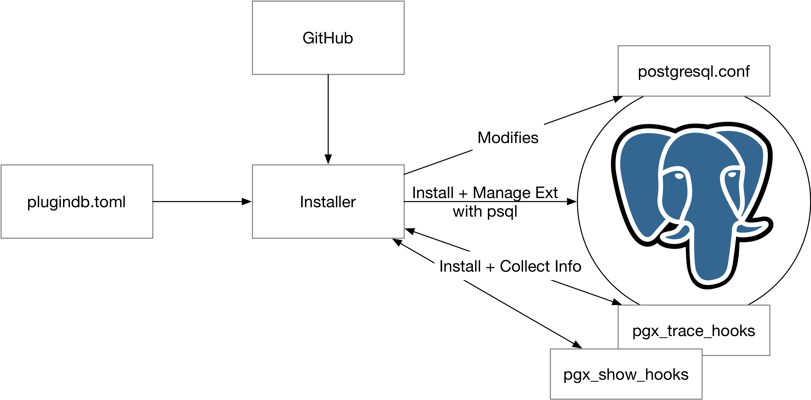
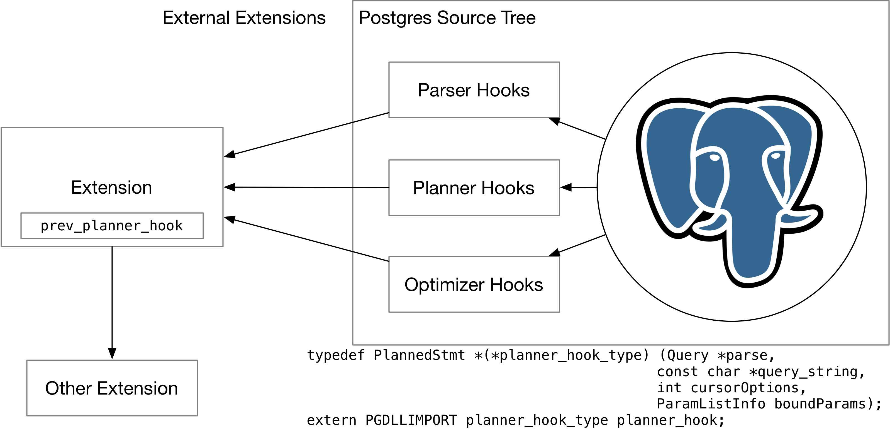
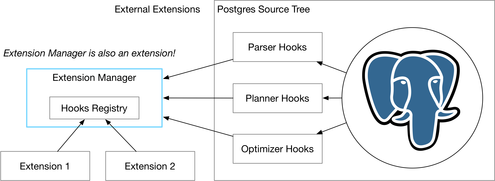

# A New Postgres Extension Environment

## Overview

The Postgres Extension Environment project aims to provide an easy way for developers to integrate their extensions with PostgreSQL. In this project:

* We will identify conflicts in existing Postgres extensions by case-study, testing and fuzzing.
* We will build an extension framework to easily install multiple extensions, and integrate existing Postgres extensions with the new framework with minimum effort.
* We will build an extension installer which automatically downloads, builds, patches, and installs Postgres extensions, along with their dependencies. This installer also facilitates our testing process.

## Architecture Design

The project is basically broken into three parts: the extension manager, the extension framework, and the conflict detection tool. Currently, we have finished the extension manager, and is working on the extension framework.

### PgExt Tool

The Postgres extension installer (pgext) tool helps user build and install extensions to their Postgres instance with on command. It also collects necessary metrics for us to identify possible conflicts between extensions by analyzing hook usage in the system.

To install an extension, the installer will read extension download URL from the plugindb config file, which
decides how to install the extension (i.e., by calling `CREATE EXTENSION` or add to `shared_preload_library`). The installer automatically detects PGXS Makefile in the extension source code,
compiles it, and install it to Postgres.

To collect information in the system, the installer will install two extensions (built by ourselves): `pgx_show_hooks` and `pgx_trace_hooks`. `pgx_show_hooks` adds a return set function to the system to collect the value of the function pointers of the hooks, so as to determine which hooks are used by the currently-installed extensions. `pgx_trace_hooks` will log all information when a hook is called, so that the installer can analyze the information to determine compability.

### Extension Framework

The extension framework currently focuses on optimizer and planner extensions. Originally, Postgres extensions directly modify the global function pointer (so-called *hooks*), so that Postgres can call the extensions during the query execution process.

The extension framework is *an extension* that provides new ways for extension developers to integrate their extensions with Postgres. After installing the extension framework to Postgres, it will take over all hooks in the system. An extension can request adding themselves to the extension registry by including the extension manager header and call `add_hook` function.

After an extension is installed to the framework, the framework will determine the order to call the extensions one by one.

Developers will need to modify their Postgres extension in order to use our extension framework. The modification should be very simple, i.e., by simply include a new header provided by us. We plan to integrate a few extensions that we already identify conflicts among them into the framework in this semester.

### Conflict Detection

We plan to study more about execution extensions and find a way to integrate them into our extension framework. We might build a tool to automatically detect conflicts by fuzzing-generating SQLs and analyzing runtime information.

## Design Rationale

### Why Building Yet Another Installer?

There are existing pgext installers, i.e., pgxn. However, There are a few problems with it:

* pgxn requires developers to generate a metadata json for their extension.
* There are only a few extensions that can be installed by pgxn.
* It does not patch Postgres config to add shared_preload_libraries.

In contrary, our pgext installer can take arbitrary git URL or zip/tar file. It will automatically build and install it to the Postgres instance. It automatically patches the source code to add our expected functionalities and to integrate with our extension framework.

### Why Building a Postgres Extension for Extension Management?

Modifying Postgres source code is non-trivial work and the changes are unlikely to be made into the upstream. Therefore, by building an extension to manage other extensions, the extension management framework can be easily used by users.

### On Detecting Conflicts

We identify several conflicts during our initial study on Postgres extensions:

* Hook Conflict.
* Behavior Conflict.
* Install Conflict.

For hook conflict, we can generate SQLs that covers code path of the extension based on the existing test cases for the extension. If extensions behave differently in different environment with the same set of SQL, then they cannot exist at the same time. This is possible to be automatically detected by tools.

For behavior conflict, this is only possible by manually reviewing all extensions. For example, pg_hint_plan includes some part of pg_stat_statements source code to ensure the plan hints, which are part of the SQL comment, are properly stored in the statistics table.

For install conflict, some extensions include Postgres source code, and therefore its correctness relies on whether it is being compiled and installed to the same Postgres version. The installer can take care of it.

## Testing Plan

We will migrate a few extensions we have already identified conflicts to our new extension framework. We will run unit tests provided by the extensions and also our own SQLs to ensure they work properly on the new framework and being installed at the same time. The current list of extensions we plan to test:

### Optimizer / Planner Extensions

* pg_stat_statements
* pg_stat_monitor
* pg_hint_plan

### Execution Extensions

TBD

## Trade-offs and Potential Problems

* Adding an extension manager between extensions and the raw Postgres hooks add a new layer of indirection and might affect performance.
* New extensions are required to be installed through our pgext installer, whereas users might need to spend some time if they want to migrate their infrastructure to our extension framework.

## Future Work

* Integrate more extensions into the framework.
* Investigate better extension framework for extensions using other hooks than planner and execution hooks.
